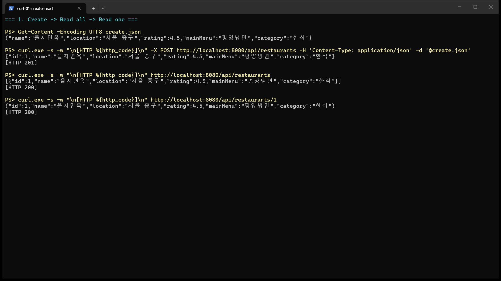
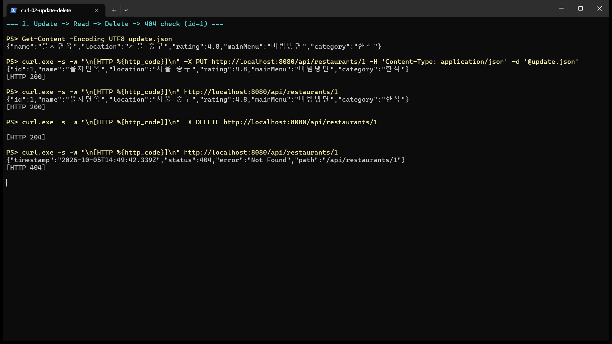
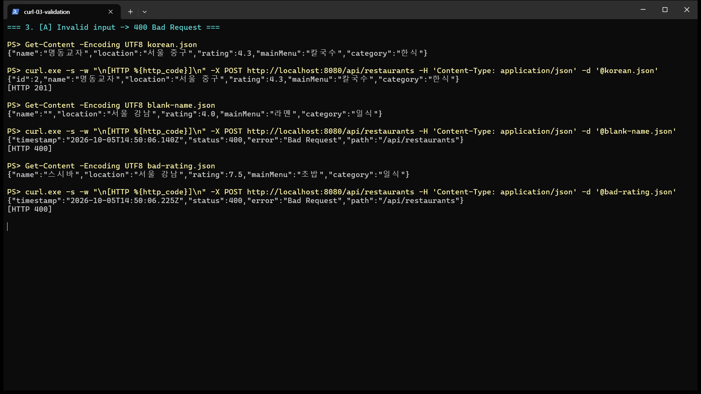
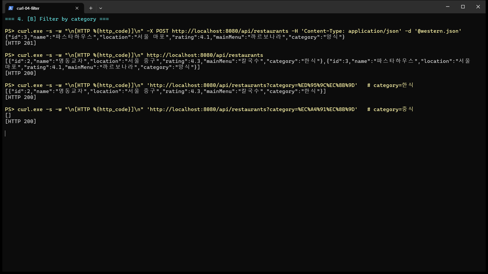

# 맛집 관리 REST API

> Spring Boot로 만든 맛집 정보 CRUD REST API입니다. 데이터베이스 없이 Java Collection(`LinkedHashMap`)에 저장합니다.

---

## ① 프로젝트 소개

### 주제와 관리하는 데이터
자주 가는 맛집이나 가 보고 싶은 맛집을 등록하고 조회·수정·삭제하는 API입니다.
맛집 한 곳(`Restaurant`)은 다음 6개 필드로 관리합니다.

| 필드 | 타입 | 설명 | 예시 |
|---|---|---|---|
| `id` | `Long` | 맛집 번호 (서버가 자동 생성) | `1` |
| `name` | `String` | 가게 이름 | `"을지면옥"` |
| `location` | `String` | 위치 | `"서울 중구"` |
| `rating` | `double` | 평점 (0 ~ 5) | `4.5` |
| `mainMenu` | `String` | 주메뉴 | `"평양냉면"` |
| `category` | `String` | 음식 종류 | `"한식"` |

### 프로젝트 구조
```
src/main/java/org/example/my_bookapi_project
├── MyBookapiProjectApplication.java      # 실행 클래스
├── controller
│   └── RestaurantController.java         # HTTP 요청/응답 처리 (/api/restaurants)
├── service
│   └── RestaurantService.java            # 비즈니스 로직, 404/400 처리, DTO 변환
├── repository
│   ├── RestaurantRepository.java         # 저장소 인터페이스
│   └── MemoryRestaurantRepository.java   # LinkedHashMap 기반 메모리 저장소
├── domain
│   └── Restaurant.java                   # 맛집 도메인 객체
└── dto
    ├── RestaurantRequest.java            # 요청 DTO (record)
    └── RestaurantResponse.java           # 응답 DTO (record)
```

요청 처리 흐름:
```
Controller → Service → Repository Interface → Memory Repository → Java Collection(LinkedHashMap)
```

### 로컬 실행 방법
1. IntelliJ에서 프로젝트를 열고 `MyBookapiProjectApplication`의 `main()`을 실행합니다.
   - 터미널에서 실행하려면 `./gradlew bootRun`(Windows는 `gradlew.bat bootRun`)을 사용합니다.
2. 서버가 `http://localhost:8080`에서 실행됩니다.
3. curl 또는 Postman으로 `http://localhost:8080/api/restaurants`에 요청합니다.

### API Endpoint
| Method | URL | 기능 | 성공 응답 | 실패 응답 |
|---|---|---|---|---|
| POST | `/api/restaurants` | 맛집 등록 | `201 Created` | `400` 잘못된 입력 |
| GET | `/api/restaurants` | 전체 조회 | `200 OK` | - |
| GET | `/api/restaurants?category={종류}` | 음식 종류로 필터링 **(확장 B)** | `200 OK` | - |
| GET | `/api/restaurants/{id}` | 단건 조회 | `200 OK` | `404` 없는 ID |
| PUT | `/api/restaurants/{id}` | 수정 | `200 OK` | `404` 없는 ID, `400` 잘못된 입력 |
| DELETE | `/api/restaurants/{id}` | 삭제 | `204 No Content` | `404` 없는 ID |

### 요청·응답 JSON 예시
**등록 요청** `POST /api/restaurants`
```json
{"name":"을지면옥","location":"서울 중구","rating":4.5,"mainMenu":"평양냉면","category":"한식"}
```
**등록 응답** `201 Created`
```json
{"id":1,"name":"을지면옥","location":"서울 중구","rating":4.5,"mainMenu":"평양냉면","category":"한식"}
```
**없는 ID 조회 응답** `404 Not Found`
```json
{"timestamp":"2026-10-05T14:49:42.339Z","status":404,"error":"Not Found","path":"/api/restaurants/1"}
```

### GitHub Repository / 배포 URL
- GitHub Repository: https://github.com/2026-2-WebService/assign05-c01-22300133
- 배포 URL: `http://localhost:8080/api/restaurants`

---

## ② 개발환경 및 Dependency

| 항목 | 작성 내용 |
|---|---|
| IDE | IntelliJ IDEA 2025.3.3 |
| JDK | Eclipse Temurin (Adoptium) JDK 17 (Gradle toolchain `languageVersion = 17`) |
| Spring Boot | 4.1.1 |
| Build Tool | Gradle 9.7.1 (Gradle Wrapper) |
| 데이터 저장 | `LinkedHashMap<Long, Restaurant>` (`MemoryRestaurantRepository`) |
| 배포 환경 | `TODO: 배포 방식과 배포 URL` |

### 사용한 Dependency
| Dependency | 필요한 이유 |
|---|---|
| `spring-boot-starter-webmvc` (Spring Web) | `@RestController`, `@GetMapping` 등으로 REST API를 만들고, 내장 Tomcat으로 서버를 실행하며, Jackson으로 DTO ↔ JSON 변환을 하기 위해 사용 |
| `spring-boot-starter-webmvc-test` | 프로젝트 생성 시 함께 추가된 테스트 의존성 (`MyBookapiProjectApplicationTests`의 컨텍스트 로딩 테스트) |

데이터베이스를 사용하지 않는 과제이므로 JPA나 DB 드라이버는 추가하지 않았습니다.
입력값 검증도 별도 라이브러리(`spring-boot-starter-validation`) 없이 `RestaurantService.validate()`에서 직접 처리했습니다.

---

## ③ Solution 분석

**Q1. 등록 요청은 어떤 순서로 처리되나요?**
A. `BookController.create()`가 `@RequestBody`로 JSON을 `BookRequest`로 받습니다. 그다음 `BookService.create()`를 호출합니다. Service는 `BookRequest`로 `Book` 객체를 만들어 `BookRepository.save()`에 넘기고, 실제 구현체인 `MemoryBookRepository.save()`가 `Map`(`LinkedHashMap`)에 저장합니다. 저장된 결과는 다시 Service → Controller 순서로 돌아오고, Controller가 `ResponseEntity.status(HttpStatus.CREATED)`로 201 응답을 만듭니다.

**Q2. `BookRequest`, `Book`, `BookResponse`는 각각 어떤 역할인가요?**
A. `BookRequest`(record)는 클라이언트가 보낸 입력값만 담는 요청 DTO라서 `id`가 없습니다. `Book`은 저장소에 실제로 저장되는 도메인 객체로, setter가 있어서 `BookService.update()`에서 값을 바꿀 수 있습니다. `BookResponse`(record)는 클라이언트에게 돌려줄 값만 담는 응답 DTO입니다. 이렇게 나누면 도메인 객체를 외부에 그대로 노출하지 않을 수 있습니다.

**Q3. 새 데이터의 ID는 어디에서 생성되나요?**
A. `MemoryBookRepository.save()`에서 생성됩니다. 필드 `private long sequence = 0L;`을 `book.setId(++sequence)`로 1씩 증가시켜 ID를 붙인 뒤 `store.put()`으로 저장합니다. Service에서는 `new Book(null, ...)`처럼 ID를 `null`로 넘깁니다.

**Q4. 존재하지 않는 ID를 요청하면 어떻게 404가 반환되나요?**
A. `BookService.findBook()`이 `repository.findById(id)`로 `Optional<Book>`을 받습니다. 값이 없으면 `orElseThrow()`로 `new ResponseStatusException(HttpStatus.NOT_FOUND, ...)`를 던지고, Spring이 이 예외를 404 응답으로 바꿉니다. `findById()`, `update()`, `delete()` 모두 먼저 `findBook()`을 호출하기 때문에 세 경우 모두 404가 반환됩니다.

**Q5. Domain 객체는 어떻게 Response DTO로 변환되나요?**
A. `BookService.toResponse(Book b)`가 `new BookResponse(b.getId(), b.getTitle(), b.getAuthor(), b.getPrice())`로 변환합니다. 전체 조회인 `BookService.findAll()`은 `repository.findAll().stream().map(this::toResponse).toList()`로 리스트의 각 요소를 변환합니다.

**Q6. Controller가 구현체가 아니라 인터페이스에 의존하는 이유는 무엇인가요?**
A. `BookService`는 생성자에서 `BookRepository` 인터페이스 타입으로 의존성을 주입받고, 실제 객체는 `@Repository`가 붙은 `MemoryBookRepository`가 주입됩니다. 그래서 나중에 DB 저장소로 바꾸더라도 Service 코드는 수정하지 않고 구현체만 교체하면 됩니다.

---

## ④ 개발 과정 요약

| 단계 | 무엇을 만들었나 | 작성한 클래스·메서드 | 확인 방법 |
|---|---|---|---|
| 1. 프로젝트 생성·오류 수정 | Spring Boot + Gradle + Spring Web 프로젝트 생성. Solution 코드를 옮기면서 남아 있던 다른 패키지(`com.webservice.week04`) import와 중복 `package` 선언을 고침 | `BookController`, `BookService` 등 | `gradlew build` 성공 확인 |
| 2. 도메인·DTO 설계 | 맛집 주제로 6개 필드 설계 | `Restaurant`, `RestaurantRequest`, `RestaurantResponse` | 컴파일 확인 |
| 3. 저장소 구현 | 인터페이스와 `LinkedHashMap` 기반 구현체, ID 자동 생성 | `RestaurantRepository`, `MemoryRestaurantRepository.save()/findAll()/findById()/update()/deleteById()` | 등록 시 id가 1, 2, 3 순서로 생성되는지 확인 |
| 4. Service·Controller 구현 | CRUD 로직, 404 처리, DTO 변환, `/api/restaurants` URL 매핑 | `RestaurantService.create()/findAll()/findById()/update()/delete()/findRestaurant()/toResponse()`, `RestaurantController` | curl로 등록 → 조회 → 수정 → 삭제 → 404 확인 (아래 스크린샷) |
| 5. 기능 확장 | 잘못된 입력 400 처리, 음식 종류 필터링 | `RestaurantService.validate()/findByCategory()`, `RestaurantController.findAll(@RequestParam category)` | curl로 정상/잘못된 입력, 필터 결과 비교 |

### 로컬 테스트 결과 (curl)
**등록 → 전체 조회 → 단건 조회**



**수정 → 수정 결과 조회 → 삭제 → 삭제한 ID 404 확인**



---

## ⑤ 기능 수정·확장

### A. 잘못된 입력 처리 (400 Bad Request)
- **추가한 이유**: 가게 이름이 비어 있거나 평점이 7.5처럼 범위를 벗어난 값이 저장되면 데이터를 믿을 수 없게 됩니다.
- **수정한 클래스와 메서드**: `RestaurantService.validate()`, `isBlank()`를 추가하고 `create()`와 `update()`에서 호출하도록 했습니다.
  - `name`, `location`, `mainMenu`, `category` 중 하나라도 `null`이거나 빈 문자열이면 `ResponseStatusException(HttpStatus.BAD_REQUEST)`를 던집니다.
  - `rating`이 0보다 작거나 5보다 크면 `ResponseStatusException(HttpStatus.BAD_REQUEST)`를 던집니다.
  - `update()`는 `findRestaurant()`를 먼저 호출하기 때문에, 없는 ID로 수정하면 400이 아니라 404가 반환됩니다.

| 테스트 요청 | 예상 결과 | 실제 결과 |
|---|---|---|
| 정상 데이터 POST (`명동교자`, 평점 4.3) | 201, 저장됨 | `201`, `id: 2`로 저장 |
| `"name":""` POST | 400, 저장 안 됨 | `400 Bad Request` |
| `"rating":7.5` POST | 400, 저장 안 됨 | `400 Bad Request` |



### B. 조회 기능 확장: 음식 종류(category)로 필터링
- **추가한 이유**: "오늘은 한식"처럼 음식 종류별로 맛집을 골라 보고 싶어서 추가했습니다.
- **요청 조건**: `GET /api/restaurants?category={음식 종류}`. `category`가 없으면 전체 조회와 같습니다.
- **수정한 클래스와 메서드**
  - `RestaurantService.findByCategory(String category)`: `findAll()` 결과를 `stream().filter()`로 `category`가 같은 것만 남깁니다.
  - `RestaurantController.findAll()`: `@RequestParam(required = false) String category`를 받아 값이 있으면 `findByCategory()`를, 없으면 `findAll()`을 호출합니다.

| 테스트 요청 | 예상 결과 | 실제 결과 |
|---|---|---|
| `GET /api/restaurants` | 한식(명동교자) + 양식(파스타하우스) 2건 | 2건 |
| `GET /api/restaurants?category=한식` | 한식 1건만 | `[{"id":2,"name":"명동교자",...,"category":"한식"}]` |
| `GET /api/restaurants?category=중식` | 조건에 맞는 데이터 없음 | `[]` |

> curl에서는 한글 쿼리 파라미터를 URL 인코딩해서 보냈습니다 (`한식` → `%ED%95%9C%EC%8B%9D`).



---

## ⑥ 배포 과정 요약

> TODO: 배포 후 작성

- 빌드 및 배포 순서: `TODO`
- 추가하거나 수정한 파일·설정: `TODO`
- 배포 중 발생한 문제와 해결 방법: `TODO`
- 배포 URL로 확인한 요청과 응답: `TODO` (GET, POST, 확장 기능 1개)

> 메모리 저장 방식이라 서버가 재시작되면 등록한 데이터가 사라지고 ID도 1부터 다시 시작합니다.

---

## ⑦ Weekly Report

### Key Learning
1. **계층 분리**: Controller는 HTTP, Service는 로직(검증·404·변환), Repository는 저장만 맡습니다. 주제를 Book에서 Restaurant로 바꿀 때 각 계층을 하나씩 바꾸면 되어서 구조를 이해하기 쉬웠습니다.
2. **DTO와 Domain 분리**: `RestaurantRequest`에는 `id`가 없고 `RestaurantResponse`에는 있습니다. 클라이언트가 ID를 정하지 못하게 하고, 서버(`MemoryRestaurantRepository.save()`)가 ID를 정합니다.
3. **예외로 HTTP 상태 코드 만들기**: `ResponseStatusException`을 던지기만 하면 Spring이 404/400 응답으로 바꿔 줍니다. 그래서 Controller에서 상태 코드를 일일이 처리하지 않아도 됩니다.

### Problem & Solution
- **문제**: Solution 코드를 프로젝트에 옮긴 뒤 컴파일이 되지 않았습니다.
- **원인**: 복사한 파일에 원래 프로젝트의 패키지(`com.webservice.week04`)가 남아 있었습니다. `BookResponse.java`에는 `package` 선언이 두 번 있었고, `BookController`에는 import와 `@RestController`, `@RequestMapping`이 빠져 있었습니다.
- **해결**: 모든 `package`/`import`를 `org.example.my_bookapi_project`로 고치고, 빠진 import와 어노테이션을 추가한 뒤 `gradlew build`로 확인했습니다.

### Code Review
```java
private Restaurant findRestaurant(Long id) {
    return repository.findById(id)
            .orElseThrow(() -> new ResponseStatusException(HttpStatus.NOT_FOUND, "Restaurant not found: " + id));
}
```
`RestaurantService.findRestaurant()`는 저장소에서 ID로 맛집을 찾습니다. `findById()`가 `Optional`을 반환하기 때문에 값이 없으면 `orElseThrow()`에서 404 예외를 던집니다. 단건 조회, 수정, 삭제가 모두 이 메서드를 거치기 때문에 "없는 ID → 404" 규칙이 한 곳에서 처리됩니다.

### AI Usage
- **질문한 내용**: 커밋한 코드에서 오류 원인 찾기, Book 코드를 맛집 주제로 바꾸기, git 충돌시 커밋푸쉬 오류 해결방법
- **참고한 답변**: 패키지 import 오류 원인, `ResponseStatusException(BAD_REQUEST)`를 이용한 검증 방식, `@RequestParam(required = false)`로 필터 파라미터를 받는 방법
- **직접 확인·수정한 부분**: curl로 정상/잘못된 입력과 필터 결과를 직접 실행해 응답 코드를 확인했습니다. `TODO: 직접 수정한 부분이 있으면 추가`

### gitbub 커밋 푸쉬 할때 충돌 오류가 발생하여서 ai한테 커밋푸쉬를 요청하였습니다.